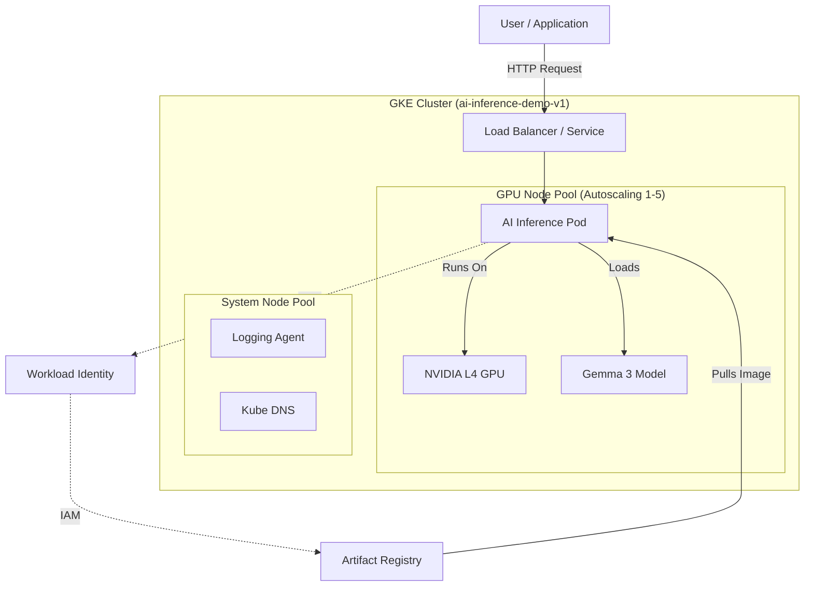

# AI Inference Platform (Demo)

This repository contains the Infrastructure-as-Code (Terraform) and Application Deployment (Helm) for the AI Inference Platform.

## Architecture



## Quick Start

### Prerequisites
*   Google Cloud Project (Authenticated)
*   Terraform installed
*   Helm installed

### 1. Build Infrastructure
```bash
cd terraform
terraform init
terraform apply
```

### 2. Deploy Model
```bash
# Connect to cluster
gcloud container clusters get-credentials ai-inference-demo-v1 --region us-east1

# Install Chart
helm install ai-inference ./helm/ai-inference
```

### 3. Test
```bash
# Verify Pods
kubectl get pods

# Test Endpoint (Internal)
kubectl run curl-test --image=curlimages/curl --restart=Never --command -- sleep infinity
kubectl exec curl-test -- curl http://ai-inference:8000/
```
