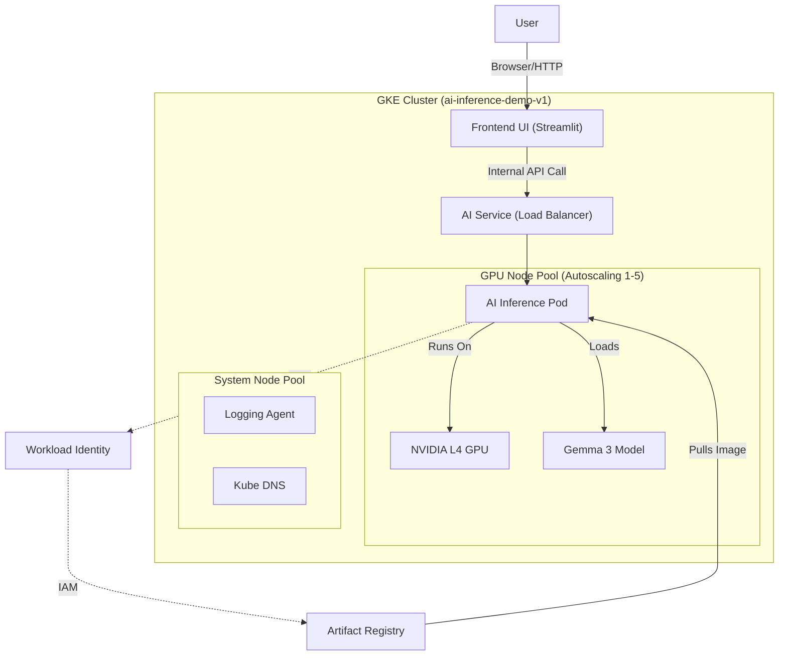

# AI Inference Platform (Demo)

This repository contains the Infrastructure-as-Code (Terraform), Application Deployment (Helm), and Frontend UI for the AI Inference Platform.

## 🚀 Live Demo
**URL:** [http://35.227.82.49](http://35.227.82.49)
*(Note: If the link is unreachable, the demo cluster may have been paused to save costs.)*

## Architecture



## Quick Start

### Prerequisites
*   Google Cloud Project (Authenticated)
*   Terraform installed
*   Helm installed
*   Python 3 (for client script)

### 1. Build Infrastructure
```bash
cd terraform
terraform init
terraform apply
```

### 2. Deploy Model
```bash
# Connect to cluster
gcloud container clusters get-credentials ai-inference-demo-v1 --region us-east1

# Install Chart
helm install ai-inference ./helm/ai-inference
```

### 3. Run Frontend (Web UI)
You can run the frontend locally or deploy it to the cluster.
```bash
# Run locally (Requires connection to cluster)
kubectl port-forward svc/ai-inference 8000:8000 &
streamlit run frontend/app.py
```
Then open **http://localhost:8501**
